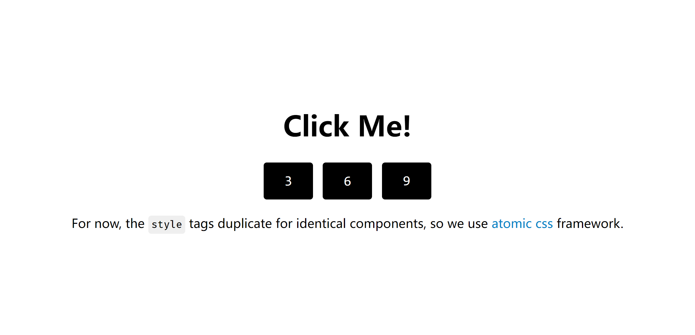

# Temponent

> *Temponent* is for **temp**late + com**ponent**

I want to build a template framework in python that support component-based development like what front-end frameworks do.

## Quick Start

New an html skeleton and a component, then `render` them with some context.

<details><summary><code>main.py</code> is the html generator</summary>

```python
from src.template import Template
a = Template.load_template("index.html")
html = a.render({"nums": [1,2,3]})
print(html)
```
</details>
<details><summary><code>index.html</code> is the html skeleton</summary>

```html

<div>
    <h1> Click Me! </h1>
    
        
            {{ i }}
        
    
</div>
```
</details>
<details><summary><code>button.html</code> is the component template</summary>

```html
<button onclick="arguments[0].target.innerText++">
    
</button>
```
</details>

Run `main.py` and you will get
```html
<div>
    <h1> Click Me! </h1>
    <button onclick="arguments[0].target.innerText++">
        1
    </button>
    <button onclick="arguments[0].target.innerText++">
        2
    </button>
    <button onclick="arguments[0].target.innerText++">
        3
    </button>
</div>
```

After adding some styles to it you can get this page like:
[](examples/counter/index.html)
You can click each button separately to increase the number above it.

## Future Features (or TODOs?)

- [ ] support spaces inside expression like `{{ a + b }}`
- [x] implement `import` syntax
- [x] support [`slot` syntax](https://svelte.dev/docs#template-syntax-slot)
- [ ] components with parameters
- [ ] support something like [`named slot` syntax](https://svelte.dev/docs#template-syntax-slot-slot-name-name)
- [ ] support while loop and isolated variable declaration
- [ ] `else` and `elif` tag
- [x] lazy compiling(assembling)
- [ ] directory based routing
- [ ] auto refresh when template file changes detected (only in dev mode and template is valid)
- [ ] caching maybe?
